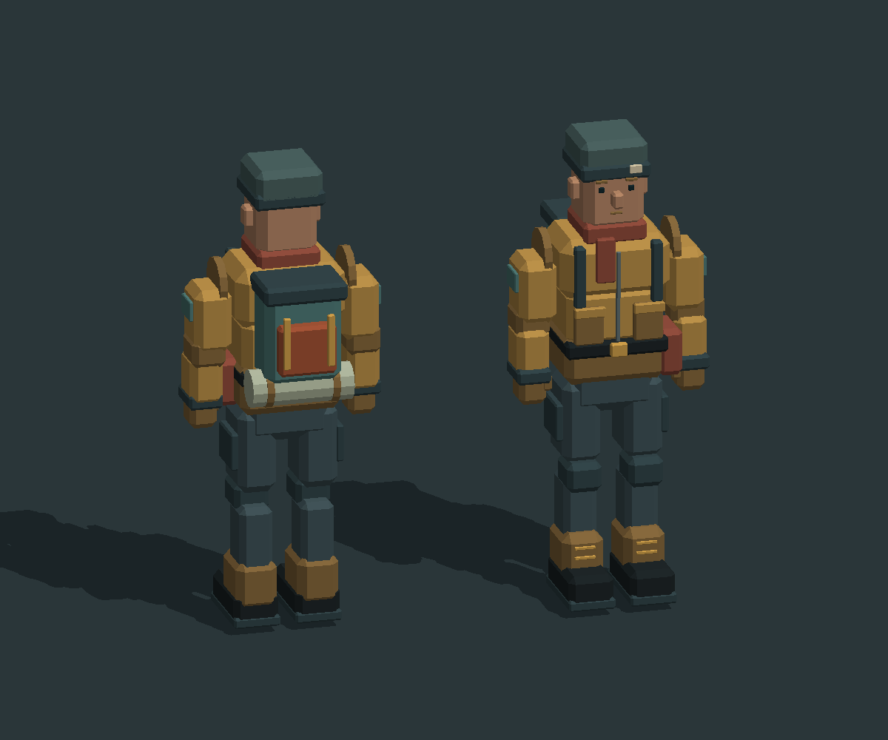
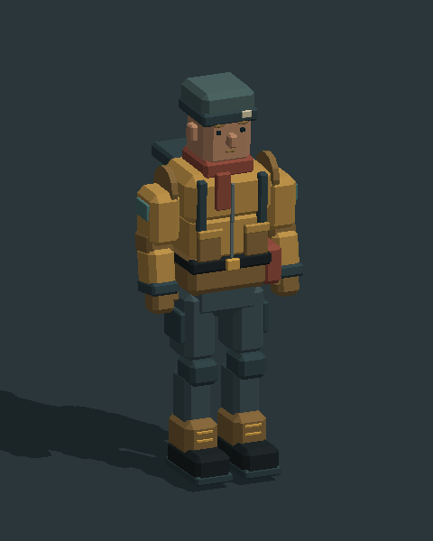

# Keeper — player-character asset prototype

An original low-poly salvager matching Low Tide's crawler: ochre work jacket,
scarf, beanie, gloves, heavy boots and a backpack with a bedroll.



## Files

- `keeper_static.glb`: ordinary mesh, with no skin or animation requirements.
  Use this for the current Sindri imported-model path; runtime appearance still
  needs verification.
- `keeper_rigged.glb`: the same geometry with 17 joints, inverse bind matrices,
  `JOINTS_0`/`WEIGHTS_0`, and five named animation clips.
- `manifest.json`: dimensions, clip durations and a proposed controller capsule.
- `walk_preview.gif`: software-rendered pose preview, not engine playback proof.

Import either GLB through Blender's glTF importer. The rigged file contains
standard glTF animation channels; no custom animator extension is required.
Blender execution was not available during creation, so no `.blend` is supplied.

## Engine boundary

At inspected engine PR #507 head `c50e6b20`,
[slice 6b](https://github.com/vardirhq/sindri-engine/blob/c50e6b20b2917ddc831187d0839430da63274ddd/docs/3d-update.md)
still lists skin/clip import, GPU skinning, `sindri.animator`, cross-fades and
editor animation previews as unfinished. The rigged asset anticipates that
work; it does not establish Sindri support. Recheck the current engine revision
before integration. The static model is a separate compatibility fallback.

This PR adds assets, not a playable controller. It does not change `poc.scene`,
camera input, crawler driving, or the engine pin. Walking on the moving crawler,
boarding, collision, interaction and selecting clips remain integration work.

## Rig and scale

- 3,276 triangles; 1.87 m tall, about 0.77 m wide in the relaxed pose.
- Ground-center origin between the feet, meters, unit scale.
- GLB: Y up, -Z forward. Source: Z up, +Y forward.
- Root, pelvis, spine, chest, head; upper arms, forearms and hands; thighs,
  shins and feet. Joint suffixes `_l`/`_r` refer to the character's sides.
- Rigid one-joint weighting per vertex suits the segmented mesh. This is not
  smooth organic skin, and joints may expose seams in extreme poses.
- In the rigged GLB, `LT_Keeper` parents the skeleton; the skinned mesh is a
  sibling scene root, as recommended by the glTF validator. Move the skeleton
  root to move the skinned character. Do not translate the mesh vertices again.
- The static silhouette fits the starter doorway; that is not a collision or
  animated-clearance playtest. The proposed capsule excludes protruding arms
  and backpack and must be checked in the actual controller.

## Clips

| Clip | Seconds | Intended use |
|---|---:|---|
| `idle` | 2.0 | Subtle breathing and head motion, looping |
| `walk` | 1.0 | In-place locomotion, looping |
| `run` | 0.7 | Faster in-place locomotion, looping |
| `carry_idle` | 2.0 | Holding an object, looping; object not included |
| `interact` | 1.2 | Right-arm reach and return, one-shot |

All use linear quaternion/translation channels and no root motion. Loop hints
are metadata; the eventual engine animator must set looping explicitly.
These are blocking-quality clips, with no IK, foot locking, turn clips, fingers,
facial rig, swimming or crawler-specific helm pose. Foot sliding and ground
contact need tuning against actual movement speed before production use.



## Rebuild and verification

From the repository root, with `numpy scipy Pillow` installed:

```sh
python scripts/build_keeper.py --render
python -m unittest discover -s tests
```

Omit `--render` to regenerate GLBs without Pillow. Mesh definitions and rigid
joint assignments live in `scripts/keeper_shapes.py`; export and clip authoring
live in `scripts/build_keeper.py`. The existing renderer gains optional framing
and lighting arguments whose defaults preserve the earlier asset previews.

Both final GLBs passed the Khronos glTF validator with zero errors, warnings,
information messages or hints. The static file also imported independently
through trimesh; source solids passed winding, watertightness and volume checks.
The repository's 19 unit tests pass, including joint weights, inverse bind
translations, normalized animation quaternions, loop endpoints, matching static
geometry and relaxed-pose doorway clearance. The pose preview was inspected.
Actual Blender and Sindri animation playback are unverified.
