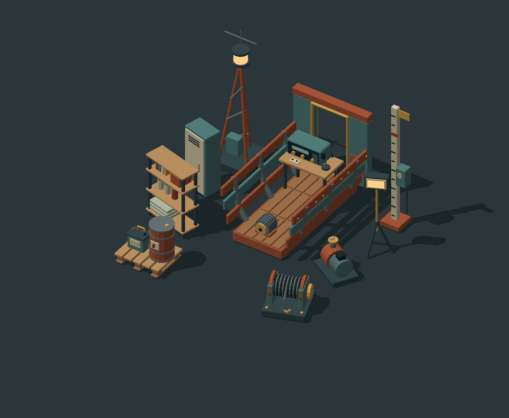
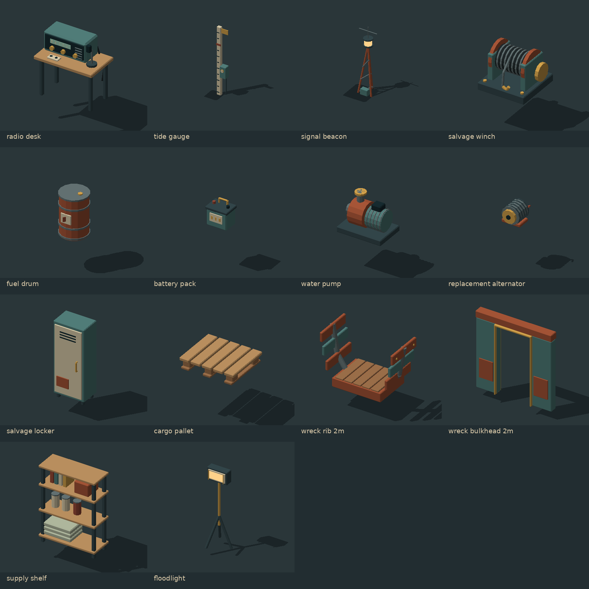

# Last Signal / salvage kit

14 actual GLB assets for the proposed opening in [Game Vision](../../docs/GAME_VISION.md).
They reuse the original crawler's steel, teal, rust, wood and warm-light palette.
These are static asset prototypes, not implemented salvage or tide gameplay.



## Included

| Asset | Intended use | Placement |
|---|---|---|
| `radio_desk` | Receiver, microphone and recovered recording | Station or crawler interior |
| `tide_gauge` | Legible quarter-meter tide marks | Basin/environment |
| `signal_beacon` | Landmark, survey instrument | Station exterior |
| `salvage_winch` | Heavy equipment recovery | Crawler deck or salvage site |
| `fuel_drum` | Physical fuel storage | Ground or pallet |
| `battery_pack` | Carryable energy equipment | Floor or shelf |
| `water_pump` | Recoverable machinery | Ground or deck |
| `replacement_alternator` | Recognizable engine repair item | Floor or workbench |
| `salvage_locker` | Equipment storage | Interior |
| `cargo_pallet` | Reusable cargo base | Ground; top at 0.235 m |
| `wreck_rib_2m` | Repeating U-shaped wreck bay | 1 m spacing along source Y |
| `wreck_bulkhead_2m` | Open end wall / doorway | 0.9 m clear width, 1.78 m height |
| `supply_shelf` | Blankets, books, tins and personal storage | Interior |
| `floodlight` | Salvage-site lighting prop | Ground/deck |



## Open and inspect

- Import any `modules/*.glb` into Blender using its glTF importer.
- `salvage_catalog.glb` contains all 14 models at their real scale.
- `last_signal_diorama.glb` assembles the same models into a small wreck site.
- Open root-level `salvage-catalog.scene` in Sindri for a static inspection scene.
  This scene uses only existing `sindri.model`, camera, environment and light
  component shapes, with project-relative paths. It is not the default scene.
- `manifest.json` supplies dimensions, triangle counts, assembly transforms,
  named sockets and conservative collision proposals.

`poc.scene`, crawler controls, equipment slots and the default startup scene are
unchanged. These assets are available for integration; they do not appear in the
current playable POC automatically. The catalog has a fixed perspective camera
and no input scripts, physics or interaction. Native/browser visual validation
is still required. PNG previews are CPU renders of the actual geometry, not
screenshots from Sindri.

## Consistent placement

- Meters, unit scale; bottom-center origin for each prop.
- Authoring/manifest: X right, Y forward, Z up.
- GLB/Sindri: X right, Y up, -Z forward; convert `(x,y,z)` to `(x,z,-y)` once.
- Prop placement snaps to 0.25 m. Wreck bays repeat on a 1 m spacing.
- Nominal footprints are planning sizes; use measured `bounds_source_m` for
  clearance, including small protruding bolts/handles.
- GLB socket local +Z points outward and +Y is the up tangent, matching the
  original kit. All props have a ground/deck mount; selected equipment has
  carry, power, operator or pipe connection markers. Markers are metadata,
  not gameplay callbacks or load ratings.
- A mount/interaction anchor does not guarantee that an object fits on the
  starter crawler. Check actual footprint, access and clearance before placement.

Collision proposals are per-part source-space boxes, not active engine
colliders. Multiple boxes preserve openings in shelves and wreck bulkheads.
For source box sizes, convert extents `(x,y,z)` to `(x,z,y)`. Simplify decorative
shapes and verify the collider count before runtime use; a box around every
render detail is excessive for production. No masses or load ratings are assigned.

## Rebuild

From repository root, install `numpy scipy Pillow` in a Python environment, then:

```sh
python scripts/build_salvage_assets.py --render
python -m unittest discover -s tests
```

The asset definitions are in `scripts/salvage_shapes.py`. Generation reuses the
existing `Low_Tide_Kit/build_kit.py` primitives/exporter and writes only this pack
and `salvage-catalog.scene`. It does not regenerate the original crawler assets.
Without `--render`, Pillow is unnecessary. Committed GLBs can be used without
Python dependencies. Unit checks use only Python's standard library.

## Limits and validation

9,496 triangles across all 14 unique meshes; individual counts are in the
manifest. All assets are textureless PBR-color meshes with authored bevels and
flat normals. No UV unwrap, LODs, skeletal rigs, door/winch animations or glass.
Emissive beacon/floodlight lenses require separate engine light components to
illuminate surroundings. Material batching combines moving-looking components;
split the named source parts before adding mechanical animations.

The build was checked with independent trimesh GLB imports and source-solid
watertightness, winding and positive-volume checks. Unit tests validate embedded
buffers, finite positions/normals, bounds/counts, socket transforms, catalog
coverage and coordinate conversion. No Blender application or Sindri runtime
execution is claimed. Existing crawler tests and equipment-slot checks pass.
