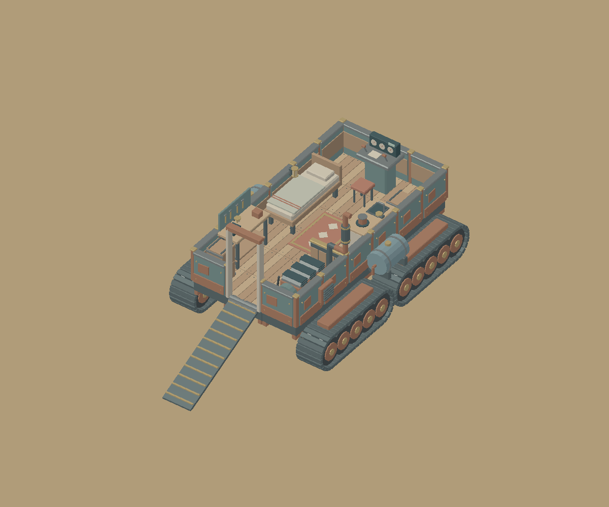
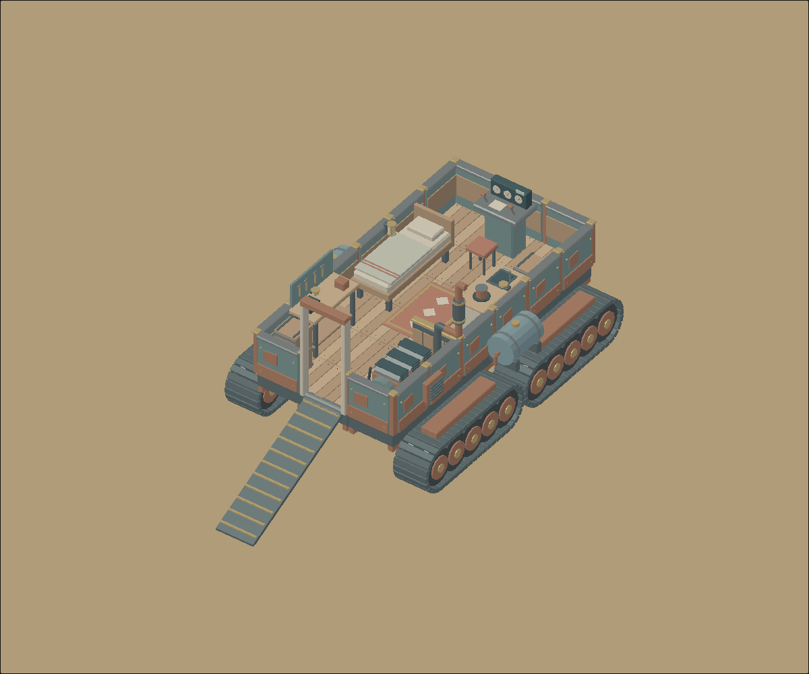

# Low Tide 3D: crawler rendering proof

The actual committed `Low_Tide_Kit/starter_crawler_cutaway.glb` renders in
Sindri's native offscreen project runtime and in the exported WebGPU browser
runtime. Both 1200 × 1000 captures were visually inspected on 2026-10-09.
Tracks, ramp, wood deck, bed, furniture and cabin are recognizable, correctly
oriented and colored. This is the external model, with normal depth-tested
geometry, rather than a baked preview or generated replacement.





## Engine requirement

Use Sindri's `feat/imported-glb-models` branch from
[engine PR #504](https://github.com/vardirhq/sindri-engine/pull/504).
Main did not support external model assets when this POC started.

`poc.scene` uses the general `sindri.model` component:

```json
{ "sindri.model": { "asset": "Low_Tide_Kit/starter_crawler_cutaway.glb", "layer": 1 } }
```

The model remains an external asset at its original location. Its SHA-256 is
`de9a1ec5d3d99cd8e2ca47ebe7e48d9fb202ccd4fddd09be85b6ea4818730ec2`.
The decoded model contains 177 nodes, 19 meshes, 85 primitives and 16 materials;
this particular model has no base-color textures. The engine's deterministic
fixture separately exercises embedded textures, multiple materials, both index
widths and reuse.

The export carried exactly three assets: the scene, the unchanged 888,192-byte
GLB and `textures/seabed.png`. Its manifest labels the GLB as `model`, verifies
its hash and places it in the normal content-hashed asset directory. Browser
smoke passed with WebGPU, a 1200 × 1000 canvas, loading screen completion and
real HTTP requests for all three asset kinds.

## Composition

The scene contains the crawler at identity transform, a flat solid-color seabed,
an orthographic three-quarter camera with vertical size 12, ambient light and a
warm directional sun. The original construction kit used Z-up, but the GLB is
already Y-up. No extra axis conversion is applied. Node names, hierarchy and
local transforms remain in the imported resource for future independent parts.

Imported-model shadows are not supported by this initial engine path and are
disabled. Skinning, animation, morphs, glTF lights/cameras and model authoring UI
are deferred. The kit's optional `KHR_lights_punctual` extension is reported as
ignored; the scene's Sindri light supplies lighting.

## Reproduce

From the engine checkout, replace `../low-tide-3d` if the repositories are not
siblings:

```bash
cargo run -p sindri-causeway --bin project-capture -- \
  ../low-tide-3d ../low-tide-3d/docs/proof/crawler-native.png 1200 1000
cargo run -p sindri-export --bin sindri-export -- \
  ../low-tide-3d target/low-tide-web --base /
cargo build -p sindri-causeway --lib --target wasm32-unknown-unknown
wasm-bindgen target/wasm32-unknown-unknown/debug/sindri_causeway.wasm \
  --target web --out-dir target/low-tide-web/pkg --out-name sindri_causeway
cd scripts/browser
npm ci
cd ../..
SINDRI_EXPECT_ASSETS=1 SINDRI_EXPECT_ASSET_KINDS=scene,model,texture \
SINDRI_VIEWPORT_WIDTH=1200 SINDRI_VIEWPORT_HEIGHT=1000 \
node scripts/browser/smoke.mjs target/low-tide-web \
  ../low-tide-3d/docs/proof/crawler-browser.png
```

Install the repo's Rust toolchain/WASM target and a `wasm-bindgen` CLI version
matching `Cargo.lock`. The inspected browser proof used Chrome headless shell
155 with software Vulkan. Set `CHROME_PATH` when supplying a browser executable.
The native proof used software Vulkan too; the capture is a real native GPU
render, not a native interactive player window.

This milestone introduces no tides, crafting, construction, diving, UI,
character movement or driving. No gameplay expansion has started.
